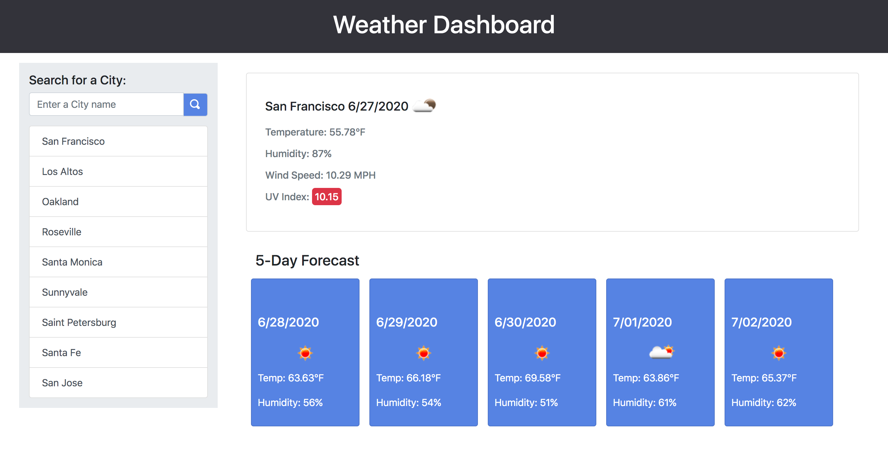

# Weather Dashboard

__*Live URL:*__ https://shhu21.github.io/weather-dashboard/

# Table of Contents
- [Objective](#objective)
- [Assumptions](#assumptions)
- [Global Variables](#global-variables)
  * [apiURL](#apiurl)
  * [apiKey](#apikey)
  * [searchCity](#searchcity)
- [Functions](#functions)
  * [callAPI](#callapi)
  * [createURL](#createurl)
  * [historyList](#historylist)
  * [saveHistory](#savehistory)
  * [createInfo](#createinfo)
  * [uvIndex](#uvindex)
  * [currentWeather](#currentweather)
  * [forecast](#forecast)
- [Mock Up](#mock-up)
- [Website Preview](#website-preview)

# Objective
Following the given mock-up, create a weather dashboard that allows a user to search a city by name and see its corresponding weather information.

# Assumptions
1. Search History 
Since it was unspecified, all search history is stored and will be continuously prepended to the history list.  
**Note:** The history list is listed by most recent (descending).  (Ex: if a city is selected from the history list, it will be moved to the top of the list.)

2. Layout and Colors
No specific CSS colors or layout sizes/spacing were supplied, so colors and layout sizes/spacing may differ from the mock-up.  
**Note:** Upon resize, the current weather and 5-day forecast information will be placed linearly following the search bar and history list section.

3. Search for a city
Cities can only be searched by city name and invalid city names will trigger an alert to notify the user that an invalid name has been inputted.

# Global Variables

## apiURL
__Data Type:__ String.  
__Purpose:__ Holds the API URL (before the call type and parameters).  

## apiKey
__Data Type:__ String.  
__Purpose:__ Holds the API key.  

## searchCity
__Parameters:__ None.  
__Return Type:__ None.  
__Purpose:__ Clears the search bar after a city name is submitted, calls `createURL` to create the API URL to get the current weather, and then passes the URL and `currentWeather` to `callURL`.

# Functions

## callAPI
__Parameters:__ String, Function.  
__Return Type:__ None.  
__Purpose:__ Calls the API and passes the response to the callback function.

## createURL
__Parameters:__ String, String, String.  
__Return Type:__ String.  
__Purpose:__ Creates the API URL string.

## historyList
__Parameters:__ String.  
__Return Type:__ None.  
__Purpose:__ Creates the previously searched history list.

## saveHistory
__Parameters:__ String.  
__Return Type:__ None.  
__Purpose:__ Save the searched city to local storage by ({city name}, {city id}). (id is created using the city name with any white spaces removed).

## createInfo
__Parameters:__ String.  
__Return Type:__ None.  
__Purpose:__ Creates each `
` tag that holds the weather data and appends its to the page. (Ex: Humidity: 45%).

## uvIndex
__Parameters:__ JSON.  
__Return Type:__ None.  
__Purpose:__ Creates the UV Index information and appends it to the page.

## currentWeather
__Parameters:__ JSON.  
__Return Type:__ None.  
__Purpose:__ Creates the current weather HTML elements and appends them to the page.

## forecast
__Parameters:__ JSON  
__Return Type:__ None.  
__Purpose:__ Creates the 5-Day Forecast HTML elements.

# Mock Up

# Website Preview

