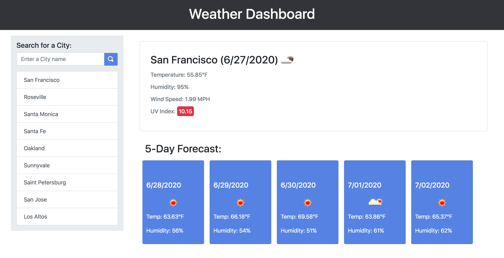

# Weather Dashboard

__*Live URL:*__ https://shhu21.github.io/weather-dashboard/

# Table of Contents

# Objective
Following the given mock-up, create a weather dashboard that allows a user to search a city by name and see its corresponding weather information.

# Assumptions
  
**Note:** 

# Global Variables

## apiURL
__Data Type:__   
__Purpose:__   

## apiKey
__Data Type:__   
__Purpose:__   

# Functions

## calllAPI
__Parameters:__   
__Return Type:__   
__Purpose:__   
__Functionality:__   

## createURL
__Parameters:__   
__Return Type:__   
__Purpose:__   
__Functionality:__   

## historyList
__Parameters:__   
__Return Type:__   
__Purpose:__   
__Functionality:__   

## saveHistory
__Parameters:__   
__Return Type:__   
__Purpose:__   
__Functionality:__   

## createInfo
__Parameters:__   
__Return Type:__   
__Purpose:__   
__Functionality:__   

## uvIndex
__Parameters:__   
__Return Type:__   
__Purpose:__   
__Functionality:__   

## currentWeather
__Parameters:__   
__Return Type:__   
__Purpose:__   
__Functionality:__   

## forecast
__Parameters:__   
__Return Type:__   
__Purpose:__   
__Functionality:__   

## searchCity
__Parameters:__   
__Return Type:__   
__Purpose:__   
__Functionality:__   

# Mock Up

# Website Preview

